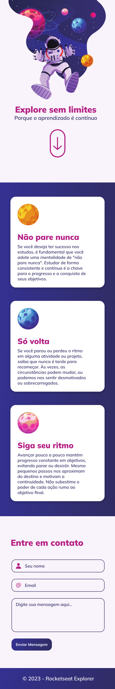
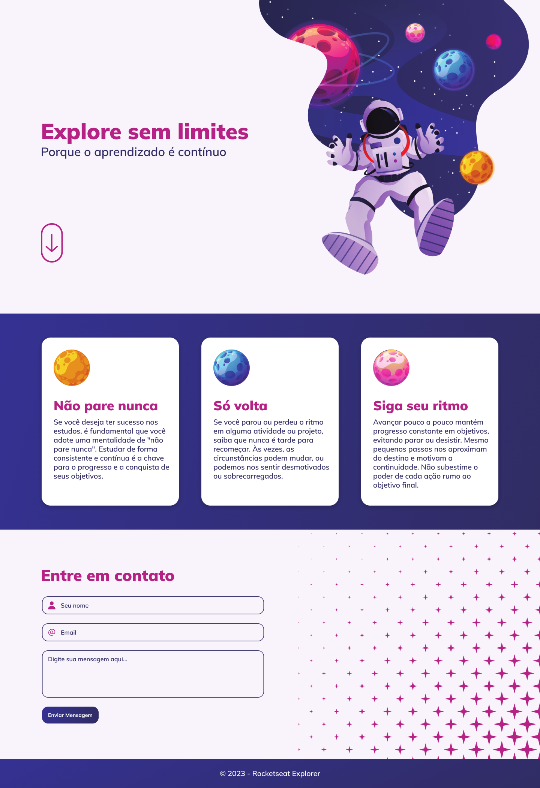

<h1 align="center"> Explore sem limites </h1>

Programa exclusivo, promovido pela trilha Explorer da Rocketseat para ensino de tecnologias WEB. 

- [Acesse o projeto finalizado, online](https://bernardosa01.github.io/Fotoblog/)
  

  <a href="#-tecnologias">Tecnologias</a>&nbsp;&nbsp;&nbsp;|&nbsp;&nbsp;&nbsp;
  <a href="#-projeto">Projeto</a>&nbsp;&nbsp;&nbsp;|&nbsp;&nbsp;&nbsp;
  <a href="#-layout">Layout</a>&nbsp;&nbsp;&nbsp;|&nbsp;&nbsp;&nbsp;
  <a href="#memo-licença">Licença</a>

  

 

  

## 🚀 Tecnologias

Esse projeto foi desenvolvido com as seguintes tecnologias:

- HTML e CSS
- Git e Github
- Figma

 Versão Mobile 
  

   

 Versão Desktop
  

## 💻 Projeto

- 
Esta aplicação foi proposta pela trilha Explorer da Rocketseat como um desafio intensivo, que engloba todo o conteúdo visto nos stages de 1 a 4 do curso.   

- 
 Neste projeto, utilizamos propriedades CSS importantes, revisando pontos passados em aula desde o início até a quarta etapa do curso, destacando-se o uso do conceito mobile first, transições, transformações, variáveis, tag's HTML semânticas, entre outros atributos.   

 

## 🔖 Layout

Você pode visualizar o layout do projeto através [DESSE LINK](https://www.figma.com/file/1eJmoaZ1CkqceOd2IUey2U/Explore-sem-limites-(Copy)?type=design&node-id=1-2&mode=design&t=NTqaiWkDe1NSi1rQ-0). É necessário ter conta no [Figma](https://figma.com) para acessá-lo.

## :memo: Licença

Esse projeto está sob a licença MIT.

---

Feito com ♥ por Bernardo Sá :wave: [Participe da comunidade da Rocketseat!](https://discord.gg/rocketseat)